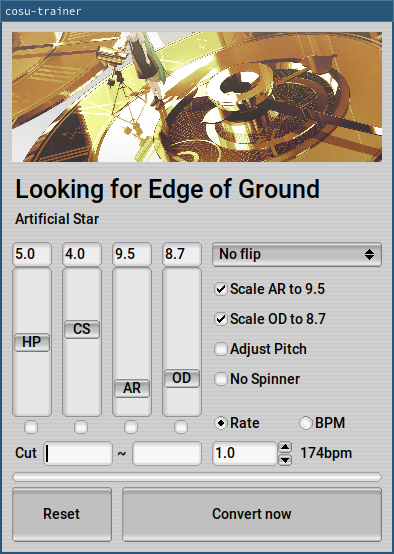

# cosu-trainer
cosu-trainer is a replacement for [FunOrange's osu-trainer](https://github.com/FunOrange/osu-trainer), but for Linux (and experimental support for Windows)

You can use all of its features with commands, so you can even put the command in your DE/WM key shortcuts for easy conversion on the fly. GUI is also provided within a single executable.

## Description
`cosu-trainer` is an actual program, which can speed up/down audio/map, and edit difficulty.

`osumem` is a memory reader for osu!, it can read what .osu file is being read and save it to a temp file so that `cosu-trainer` can read.

`cleanup` is a MP3 cleaner that can run in osu! songs folder (`cleanup <osu song folder>`).
Basically removes every MP3 that is not used as a main audio file in any .osu file in the same folder.
It's very destructive and experimental, so don't use unless you desperately need it.

### Features
- Can speed up/down audio/map
- Supports all modes, but not tested enough tho
- Emulates DT if either (scaled) AR or OD is over 10
- Scales AR/OD, but you can cap so that it won't scale over the value you put
- Adds osutrainer tag like osu-trainer
- Can flip/transpose a map
- Generates an osz file for easier import
- An user-defined osz handler can be set for seamless integration with osu!
- Supports MP3 and [all formats that libsndfile supports](https://libsndfile.github.io/libsndfile/formats.html). (though osu! only accepts ogg and mp3 as rankable formats)
- Can launch commands as AR changes (you can use it to adjust gamma automatically)

### Requirements
- osu! must run on WINE with dotnet 4.5+ for proper memory scanning
- libmpg123, libmp3lame, libsndfile and libsoundtouch to adjust audio speed
- libzip to make an osz file
- libfltk1.3 for GUI

### DEB/RPM/Arch repository
My [wine-osu repository](https://build.opensuse.org/project/show/home:hwsnemo:packaged-wine-osu) also provides cosu-trainer.
You can get it [here](https://software.opensuse.org//download.html?project=home%3Ahwsnemo%3Apackaged-wine-osu&package=cosu-trainer)!

### How to build
1. Install header packages of dependencies
2. Run `meson build && ninja -C build`
3. Binaries should be in 'build' folder.

### How to use
1. Grab `cosu-trainer` and `osumem`
2. Run osu! and get into song select
3. Linux: Run `./osumem` (Most systems require root permission to run this)
4. Linux: Set `OSU_SONG_FOLDER` variable (`export OSU_SONG_FOLDER=/put/osu/Songs/`, I recommend putting it into your .profile), or `echo "<your Songs path>" > ~/.cosu_songsfd`
5. Now you can use `./cosu-trainer` or `cosu-trainer.exe` (read usage below)
6. After converting a map with it, press f5 in the game to refresh

### `cosu-trainer` GUI screenshot


Run `cosu-trainer` with no arguments to launch GUI. You can use below arguments if you don't want GUI.

### `cosu-trainer` command usage
```
./cosu-trainer <filename|auto> <rate|bpm> [a/o/h/c] [p] [x/y/t]
<> are requirements, [] are optional
<filename|auto> : specify file name like 'songfolder/diff.osu' or just put 'auto' if you are running `osumem`
<rate|bpm> : '1.2x' if you want to use rate, '220bpm' if you want to use bpm (it uses max bpm of map to calculate, so be careful)
             the program will try to guess if x or bpm is not specified
[a/o/h/c] : ar/od/hp/cs respectively. a9.9 to set ar as 9.9.
            cosu-trainer scales ar/od by default. use af/of to fix them
            you can add 'c' at the end to cap the value, it still scales, but won't scale over the value you put
[p] : if you want daycore/nightcore
[x/y/t] : xflip, yflip and transpose respectively.

example: ./cosu-trainer auto 220bpm a7.2c c7.2 h7 p
```

### How to open a converted map automatically
You can set `OSZ_HANDLER` variable (`export OSZ_HANDLER="xdg-open \"{osz}\""`) to make cosu-trainer open the map automatically just after the conversion. Unsetting the variable disables this feature.

I recommend getting [osu-handler](https://aur.archlinux.org/packages/osu-handler) by openglfreak, and let it handle .osz files by setting file association.
`xdg-open` will open osu-handler if a given file is identified as an osu! beatmap archive.
You can also get DEB/RPM of osu-handler [here](https://software.opensuse.org//download.html?project=home%3Ahwsnemo%3Apackaged-wine-osu&package=osu-handler-wine).
I package this one, so if there's any problem with it, let me know!

### How to adjust gamma automatically (only on Linux for now)
You can make a file named `.cosu_arconf` in your home directory to let cosu-trainer adjust your gamma as AR of the map your map changes!
Just change `echo` commands to `xgamma` or whatever you want. `default` command will be used if the AR is not in ranges of every entry, or whenever you stop playing a map.
```
0      5 echo ar is within 0 and 5
5      7 echo ar is within 5 and 7
9    9.6 echo ar is within 9 and 9.6
9.6   10 echo ar is within 9 and 10
10    11 echo ar is within 10 and 11
default  echo ar is default
```

### Experimental Windows support
Things mostly work but it's kinda flaky. You can use [MSYS2](https://msys2.org) (Note that cosu-trainer only supports UCRT).
Install MinGW GCC and all dependencies through their package manager and use a following command in `src` to compile cosu-trainer.
```
x86_64-w64-mingw32-g++ -DWIN32 `fltk-config --use-images --cxxflags` \
cosuui.cpp cosuwindow.cpp  cuimain.c main.cpp tools.c mapeditor.c actualzip.c audiospeed.cpp buffers.c cosumem.c freader_win.cpp wsigscan.c cosuplatform_win.c \
-o ../cosu-trainer `fltk-config --use-images --ldflags` -lwinpthread -lmpg123 -lmp3lame -lzip -lSoundTouch -lsndfile -lwtsapi32
```

**Some limitations**
- cosu-trainer may become unresponsive while converting a map, just wait for a bit, and you will have a converted map.
- CUI works, but 'auto' doesn't work
- Custom songs folder doesn't work at the moment
- `OSZ_HANDLER` doesn't work

## Thanks a lot to
- Thanks a lot to developers of libraries I used in this program!!!
- [josu-trainer](https://github.com/ngoduyanh/josu-trainer) for basic idea of speeding up the map
- [gosumemory](https://github.com/l3lackShark/gosumemory) and [ProcessMemoryDataFinder](https://github.com/Piotrekol/ProcessMemoryDataFinder) for memory reading
